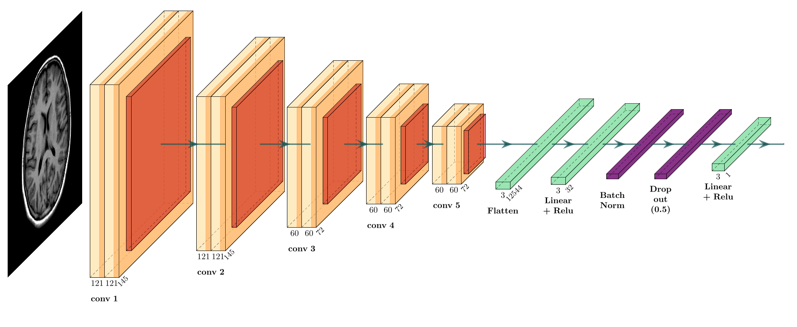
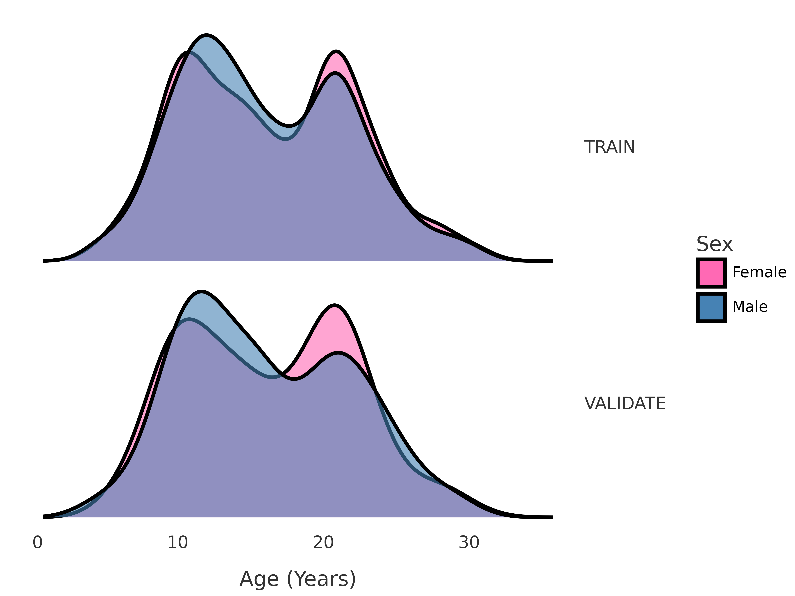
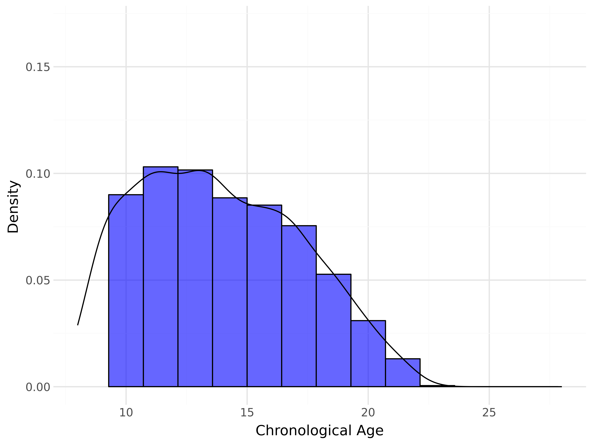
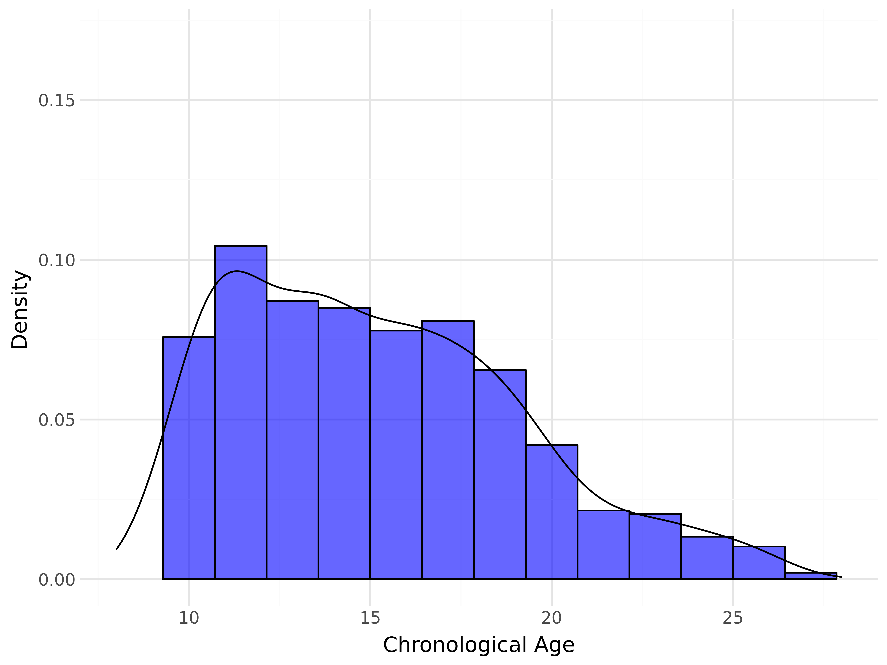
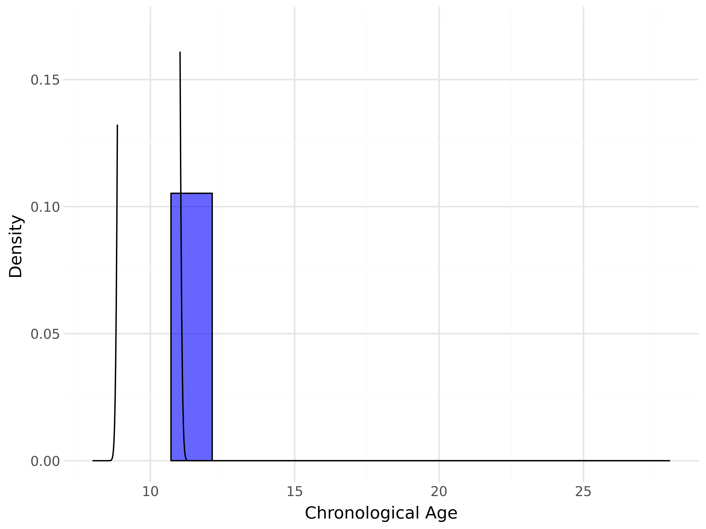
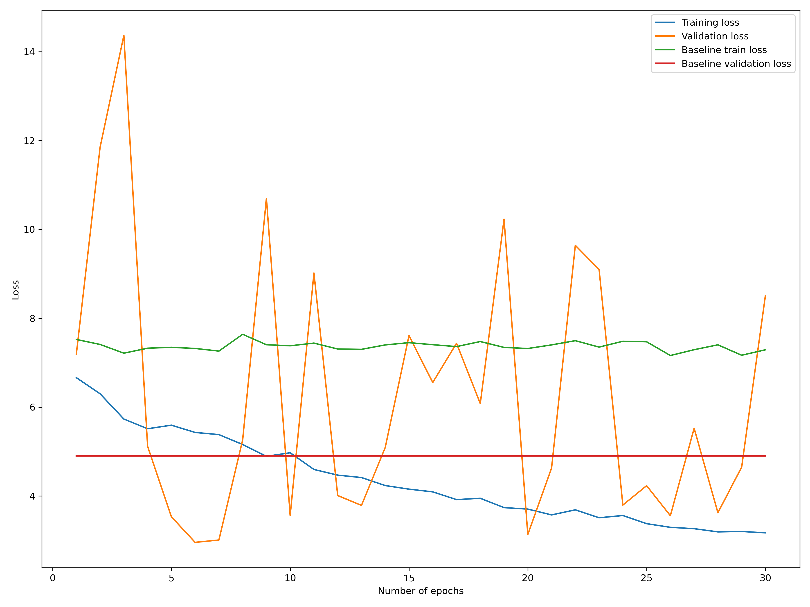
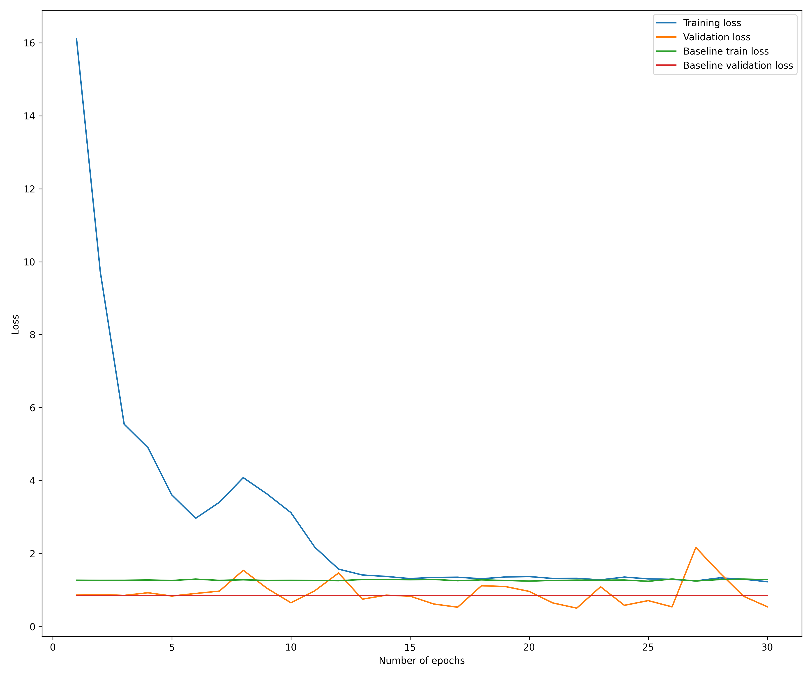
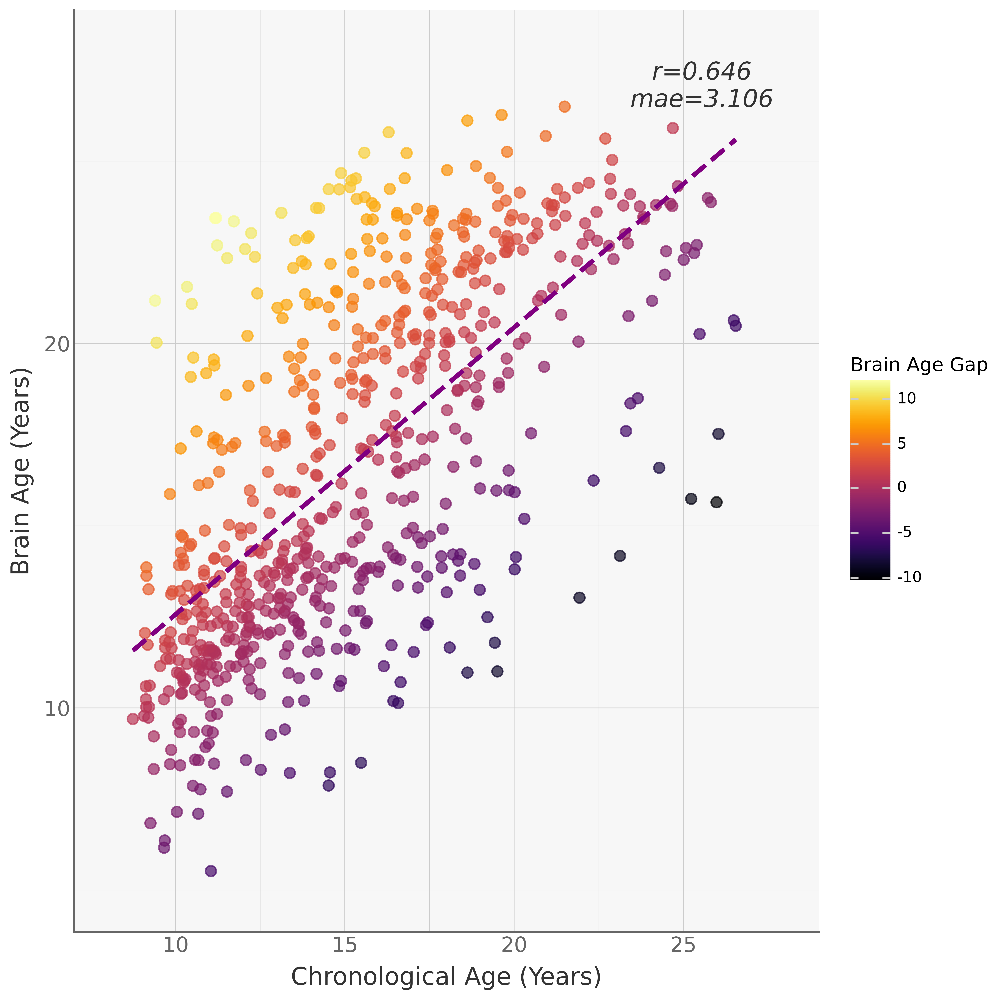
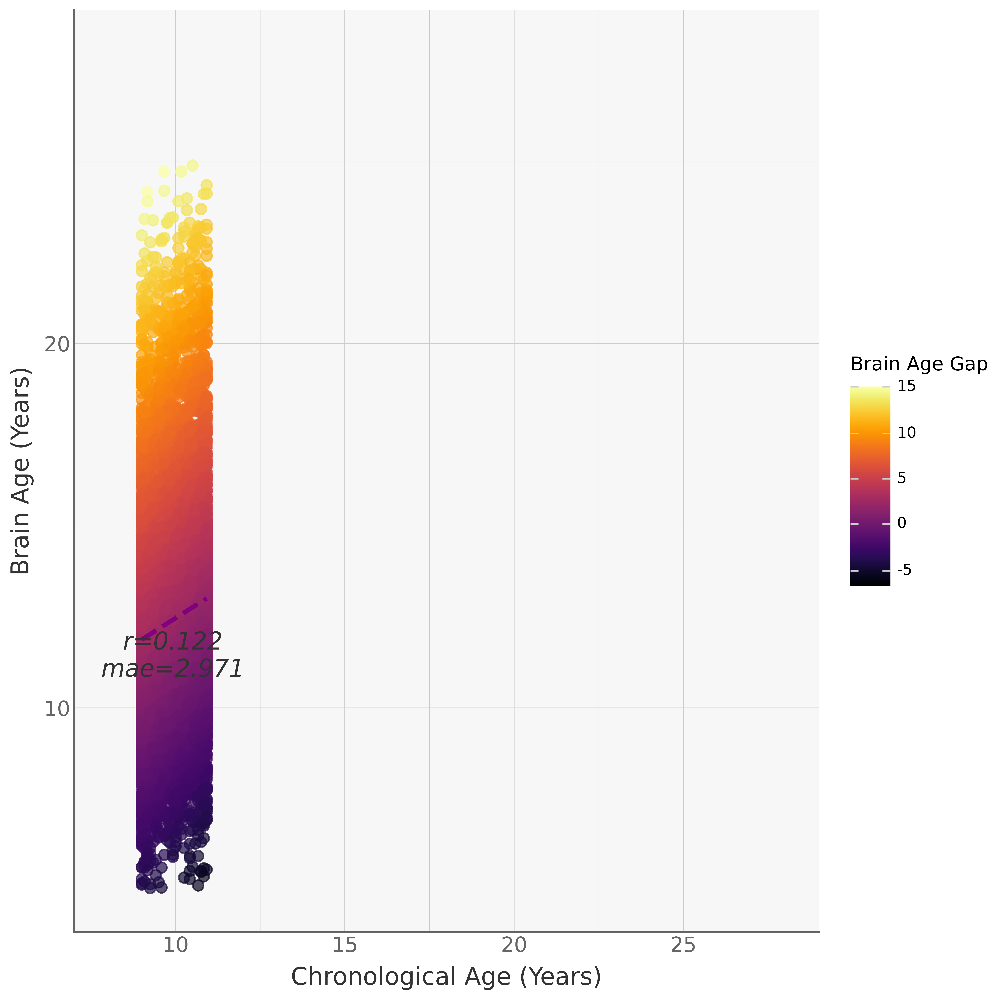

## Combined CNN-MLP-Classifier for Brain Age Estimation

- This repo contains code for training and testing a convolutional neural network (CNN) on T1w brain images. The CNN outputs an age for each participant; I included a classifier during training to try 'persuade' the regression task not to regress to the mean (of the training set). NB: each folder has a README file that documents the purpose of each script or notebook.

#### Model Architecture

- I utilized a modified version of the VGG-16 architecture given its commendable performance in brain age estimation [Joo et al., 2023]. The input T1w image size for the model is 121*145*121

<p>
  
</p>

#### Training Data

I used a training set that comprised of participants from 6 sites (ABIDE I & II, CMI, CORR, NIH and PING). The training sample included 2884 healthy participants (Mean age=15.43, SD=5.79); 2308 participants were used for training, while 576 were used as the validation set

<p float="left">
  
</p>

#### Testing Data

Testing Set: I estimated brain age on 790 participants (1500 scans, Mean age=13.60,SD=3.48) from the Brazilian High Risk Cohort (BHRC), a large community-based study investigating psychopathology over development (Salum et al., 2015), 274 participants from the FORBOW cohort (673 scans, Mean age=15.20,SD=4.00), and 8753 participants from the ABCD cohort (Mean age=10.30,SD=3.48). We then estimated BAG (BAG = predicted age – chronological age).

<p float="left">
    <figcaption>BHRC Age Distribution</figcaption>
    
    <figcaption>Forbow Age Distribution</figcaption>
    
    <figcaption>ABCD Age Distribution</figcaption>
    
</p>

#### Model performance

- The model performed quite poorly early on (image below). Specifically, the model would perform well on the train set, but performance on the validation was poor, and erratic. This meant that the model was overfitting and it was quite unstable in its predictions. I experimented with several techniques:
    1. I used the ```WeightedRandomSampler``` function to weight the classes so that the classification task was balanced. This did not help much.
    2. I Normalized the age. This helped a bit
    3. I experimented with ```L1``` and ```L2``` regularization. L2 regularization ultimately allowed the model to perform as expected. This makes sense given that L2 regularization smooths the loss function, which is important in aiding the models predictions to be stable

<p float="left">
  <figure>
    <figcaption>Before regularization</figcaption>
    
  </figure>
  <figure>
    <figcaption>After L2 regularization</figcaption>
    
  </figure>
</p>

I chose the best performing model and tested it in our 3 cohorts.

#### Predictions

The CNN-MLP-Classifier performed alright on our test set as seen in the scatter plots below.

<p float="left">
  <figure>
    <figcaption>BHRC Predictions</figcaption>
    
  </figure>
  <figure>
    <figcaption>Forbow Predictions</figcaption>
    
  </figure>
  <figure>
    <figcaption>ABCD Predictions</figcaption>
    
  </figure>
</p>

- The model performs well, but not as well as XGBoost, which I had tested earlier. One limitation is that we dont have much data (2,884 is not enough data for a CNN unfortunately). So, in the end we decided to stick with the XGboost model. 

#### Next steps 
If we can get access to more data, some of the exciting follow ups I would like to investigate are:

    1. Data augmentation
    2. Experimenting with different dropout rates (0.1%, 0.3%, 0.5%)
    3. Using other architectures like the ResNet architecture (Rajabli et al., 2025)
    4. using a foundational model (Dufumier et al., 2021). 

P.S. My colleague [Sri-Harsha](https://github.com/Sri-Harsha)  did experiment with a foundational model, but its performance was not nearly as good as the CNN-MLP-Classifier shown here; we surmised that the main reason for this is the small training data we have, especially since the foundational model was trained on 10,420 participants (Mean age=32,  SD=19); retraining it on 2,884 young participants was not enough for it to learn to predict well for a younger cohort. 


##### References

1. Joo, Y., Namgung, E., Jeong, H., Kang, I., Kim, J., Oh, S., Lyoo, I. K., Yoon, S., & Hwang, J. (2023). Brain age prediction using combined deep convolutional neural network and multi-layer perceptron algorithms. Scientific reports, 13(1), 22388. https://doi.org/10.1038/s41598-023-49514-2

2. Rajabli, R., Soltaninejad, M., Fonov, V. S., Bzdok, D., & Collins, D. L. (2025). Brain Age Prediction: Deep Models Need a Hand to Generalize. Human brain mapping, 46(11), e70254. https://doi.org/10.1002/hbm.70254

3. Dufumier, B., Gori, P., Victor, J., Grigis, A., Wessa, M., Brambilla, P., Favre, P., Polosan, M., Mcdonald, C., Piguet, C., & Duchesnay, E. (2021). Contrastive Learning with Continuous Proxy Meta-Data for 3D MRI Classification. International Conference on Medical Image Computing and Computer-Assisted Intervention.
 

